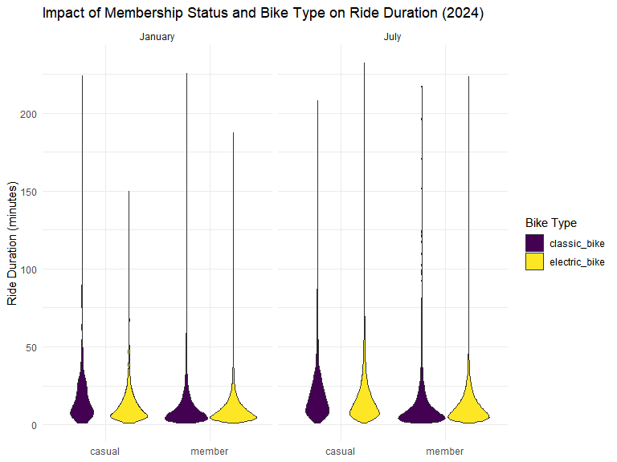

p8105_hw3_ws2721
================
2024-10-11

## Problem 1

From Answer Key provided:

This dataset contains 2595176 rows and 7 columns. Variables include
weather station id, date of observation, (tenths of mm), snowfall (mm),
snow depth (mm), and min and max temperature (tenths of degrees C).

Below we clean the data, creating separate variables for year, month,
and day and converting `tmax` and `tmin` to numeric. We find that 0 is
the most commonly observed value for snowfall. This is because most days
of the year, it does not snow at all in NY. The second most commonly
observed value is `NA`, indicating missingness. Other common values are
13, 25, and 51, suggesting that snowfall is originally recorded in
fractions of an inch and converted to mm.

``` r
ny_noaa %>% 
  count(snow) %>%
  arrange(desc(n))

ny_noaa = 
  ny_noaa %>% 
  separate(date, into = c("year", "month", "day"), convert = TRUE) %>% 
  mutate(
    tmax = as.numeric(tmax),
    tmin = as.numeric(tmin))
```

Below is a two-panel plot showing the average max temperature in January
and in July in each station across years. As expected, the mean
temperature in January is much lower than the mean temperature in July
for all stations and across all years. All stations appear to follow
similar trends of temperature peaks and valleys within a month across
the years, i.e. when one station has a high monthly mean temperature for
a given year, most other stations also have a high monthly mean
temperature for that year. We do see one uncharacteristically cold
station in July of 1987 or 1988, as well as a few other less drastic
outliers.

``` r
ny_noaa %>% 
  group_by(id, year, month) %>% 
  filter(month %in% c(1, 7)) %>% 
  summarize(mean_tmax = mean(tmax, na.rm = TRUE, color = id)) %>% 
  ggplot(aes(x = year, y = mean_tmax, group = id)) + geom_point() + geom_path() +
  facet_grid(~month) +
  labs(title = "Mean monthly temperature for each station across years for January and July")
```

Below we show a two-panel plot including (i) a hex plot of `tmax` vs
`tmin` for the full dataset; and (ii) a ridge plot showing the
distribution of snowfall values (in mm) greater than 0 and less than 100
separately by year.

From the hex plot we see that while there is some variability, the
majority of the data cluster tightly in the center of the distribution.
In relatively rare cases, it seems that `tmax` is less than `tmin`,
which raises questions about data recording and quality.

From the ridge plot, we see a multimodal density of snowfall within a
given year. Most stations see between 0 and 35 mm of snow in a year.
Then there is a another group of stations that see about 45 mm of snow,
and another group that sees nearly 80 mm. It is likely this
multimodality stems from the conversion of measurements in one system
(fractions of an inch) to another (using the metric system), which was
also noted in the table of common values.

``` r
hex = 
  ny_noaa %>% 
  ggplot(aes(x = tmin, y = tmax)) + 
  geom_hex()

ridge = 
  ny_noaa %>% 
  filter(snow < 100, snow > 0) %>%
  ggplot(aes(x = snow, y = as.factor(year))) + 
  geom_density_ridges()

hex + ridge
```

## Problem 2

``` r
accel = read.csv("./data/nhanes_accel.csv", na = c("NA","."," "))|> 
  janitor::clean_names()

demo = read.csv("./data/nhanes_covar.csv", skip = 4, na = c("NA","."," ")) |> 
  janitor::clean_names() |> 
  filter(age >= 21) |> 
  drop_na()
```

``` r
print(sum(is.na(accel)))
```

    ## [1] 0

``` r
print(sum(is.na(demo)))
```

    ## [1] 0

``` r
full_df = merge(accel, demo, by = "seqn") |> 
  pivot_longer(cols = min1:min1440, names_to = "min", names_prefix = "min",
               values_to = "MIMS") |> 
  mutate(min = as.integer(min))
```

The demographic data has keys on the first four rows, so had to remove
the keys to get the data straight. Also, removed all the individuals
that were less than age 21. Checked if there is any missing value in the
data set and merged by seqn.I have changed the minute to integer and
made the data set longer for future data visualization.

The key for the demo:

Sex: 1 = Male, 2 = Female Education: 1 = Less than high school, 2 = High
school equivalent, 3 = More than high school

``` r
ge_table = full_df |>
  group_by(sex, education) |>
  count() |> 
  mutate(sex = recode(sex, `1` = "Male", `2` = "Female"), 
         education = recode(education, `1` = "Less than high school",
                            `2` = "High school equivalent",
                            `3` = "More than high school")) |> 
  pivot_wider(names_from = "sex", values_from = n)

knitr::kable(ge_table, format = "html")
```

<table>
<thead>
<tr>
<th style="text-align:left;">
education
</th>
<th style="text-align:right;">
Male
</th>
<th style="text-align:right;">
Female
</th>
</tr>
</thead>
<tbody>
<tr>
<td style="text-align:left;">
Less than high school
</td>
<td style="text-align:right;">
38880
</td>
<td style="text-align:right;">
40320
</td>
</tr>
<tr>
<td style="text-align:left;">
High school equivalent
</td>
<td style="text-align:right;">
50400
</td>
<td style="text-align:right;">
33120
</td>
</tr>
<tr>
<td style="text-align:left;">
More than high school
</td>
<td style="text-align:right;">
80640
</td>
<td style="text-align:right;">
84960
</td>
</tr>
</tbody>
</table>

To make a table that counts male and female in each educational
category, I first grouped them by their category and counted the
numbers.Then, recoded their numbers to avoid mistakes. Then, made it
wider to be reader-friendly.

According to the table, the number of male and female in each
educational category is not that different except for the “High school
equivalent” category. There are about 20000 more male in the category
compared to females.

``` r
print(
  ggplot(full_df, aes(x = age, y = factor(education), fill = factor(sex))) +
  geom_density_ridges(alpha = 0.5, scale = 0.9) +
  theme_minimal() +
  labs(title = "Age Distributions by Education Category and Gender",
    x = "age",
    y = NULL,
    fill = "Sex",
    name = "Sex"
  ) +
  scale_fill_discrete(labels = c("1" = "Male", "2" = "Female")) +
  scale_y_discrete(labels = c(
    "1" = "Less than high school", 
    "2" = "High school equivalent", 
    "3" = "More than high school"
  )))
```


The graph shows that the distribution of the age is different per their
education level. The “More than high school” category tend to show more
number of younger female than male population while it is opposite in
the “High school equivalent” category as there are more female that are
older compared to male. “Less than high school” category has similar
distribution except for the higher peak in age between 40~50 for males
compared with female.

``` r
total_activity_df = full_df |> 
  group_by(seqn, age, sex, education) |> 
  summarise(total_activity = sum(MIMS, na.rm = TRUE), .groups = "drop")
```

``` r
print(
  ggplot(total_activity_df, aes(x = age, y = total_activity, color = factor(sex))) +
  geom_point(alpha = 0.6) +
  geom_smooth() +
  theme_minimal() +
  labs(title = "Total Daily Activity vs. Age by Education Level and Gender",
    x = "Age",
    y = "Total Daily Activity",
    color = "Sex"
  ) +
  scale_color_viridis_d(labels = c("1" = "Male", "2" = "Female")) +
  facet_wrap(~ factor(education, levels = c(1, 2, 3), 
                      labels = c("Less than high school", 
                                 "High school equivalent", 
                                 "More than high school"))))
```


As expected, the total daily activity decrease as people age, both male
and female regardless of their education level. However, as the
education level gets higher, the trend shows less difference comparing
young age vs older age within the education level.there is also a high
peak for female who are aroung age 40 in the “High school equivalent”
category.

``` r
hourly_activity_df = full_df |> 
  mutate(hour = (min) %/% 60) |>
  group_by(seqn, education, sex, hour) |> 
  summarise(mean_activity = mean(MIMS, na.rm = TRUE))
```

``` r
print(
  ggplot(hourly_activity_df, aes(x = hour, y = mean_activity, color = factor(sex))) +
  geom_point(alpha = 0.01) +
  geom_smooth(alpha = 0.8) +
  facet_wrap(~ factor(education, levels = c(1, 2, 3), 
                      labels = c("Less than high school", 
                                 "High school equivalent", 
                                 "More than high school")), nrow = 3) +
  theme_minimal() +
  scale_x_continuous(limits = c(0, 24), breaks = seq(0, 24, by = 6)) +
  scale_y_continuous(limits = c(0, 20), breaks = seq(0, 20, by = 4)) +
  labs(
    title = "24-Hour Activity Time Courses by Education Level and Gender",
    x = "Hour of the Day",
    y = "Mean Activity",
    color = "Gender"
  ) +
  scale_color_viridis_d(labels = c("1" = "Male", "2" = "Female")))
```


The general trend for all population is that the activity starts to
increase starting of 6am and decreases starting of 6pm.The trend of the
activity is similar between the categories “Less than high school” and
“High school equivalent”. However, it is different in “More than high
school” group that male have generally less activity recorded between
6am and 6pm compared to female.

Also applied the axis limits to see the trendline effectively.

## Problem 3

``` r
jan20 = read.csv("./data/Jan 2020 Citi.csv") |> 
  janitor::clean_names() |> 
  mutate(month = "January", year = "2020")

jan24 = read.csv("./data/Jan 2024 Citi.csv") |> 
  janitor::clean_names() |> 
  mutate(month = "January", year = "2024")

jul20 = read.csv("./data/July 2020 Citi.csv") |> 
  janitor::clean_names() |> 
  mutate(month = "July", year = "2020")

jul24 = read.csv("./data/July 2024 Citi.csv") |> 
  janitor::clean_names() |> 
  mutate(month = "July", year = "2024")
```

``` r
citi_bike = bind_rows(jan20, jan24, jul20, jul24)
```

The data shows the usage of the citi bike, what type of bike was used
for in what day of the week and how long, including the membership
status of the person using it with start and end station. We have 2020
and 2024, January and July data. (1% of all rides with a total duration
less than 4 hours each in these four months -\> from HW document)

``` r
rides = citi_bike |> 
  group_by(month, year, member_casual) |> 
  summarise(total_rides = n()) |> 
  spread(member_casual, total_rides, fill = 0)

colnames(rides) <- c("Year", "Month", "Citi_Bike_Members", "Casual_Riders")

knitr::kable(rides, format = "html")
```

<table>
<thead>
<tr>
<th style="text-align:left;">
Year
</th>
<th style="text-align:left;">
Month
</th>
<th style="text-align:right;">
Citi_Bike_Members
</th>
<th style="text-align:right;">
Casual_Riders
</th>
</tr>
</thead>
<tbody>
<tr>
<td style="text-align:left;">
January
</td>
<td style="text-align:left;">
2020
</td>
<td style="text-align:right;">
984
</td>
<td style="text-align:right;">
11436
</td>
</tr>
<tr>
<td style="text-align:left;">
January
</td>
<td style="text-align:left;">
2024
</td>
<td style="text-align:right;">
2108
</td>
<td style="text-align:right;">
16753
</td>
</tr>
<tr>
<td style="text-align:left;">
July
</td>
<td style="text-align:left;">
2020
</td>
<td style="text-align:right;">
5637
</td>
<td style="text-align:right;">
15411
</td>
</tr>
<tr>
<td style="text-align:left;">
July
</td>
<td style="text-align:left;">
2024
</td>
<td style="text-align:right;">
10894
</td>
<td style="text-align:right;">
36262
</td>
</tr>
</tbody>
</table>

There is a general trend of increase in both citi bike members and
casual riders.However, The increase rate is bigger between Jan - July
compared to July - Jan. In fact the citi bike members even decreased
between July 2020 and January 2024.

``` r
top_stations = citi_bike |> 
  filter(month == "July", year == 2024) |> 
  group_by(start_station_name) |> 
  summarise(Number_of_Rides = n()) |> 
  arrange(desc(Number_of_Rides)) |> 
  head(5)

knitr::kable(top_stations, format = "html")
```

<table>
<thead>
<tr>
<th style="text-align:left;">
start_station_name
</th>
<th style="text-align:right;">
Number_of_Rides
</th>
</tr>
</thead>
<tbody>
<tr>
<td style="text-align:left;">
Pier 61 at Chelsea Piers
</td>
<td style="text-align:right;">
163
</td>
</tr>
<tr>
<td style="text-align:left;">
University Pl & E 14 St
</td>
<td style="text-align:right;">
155
</td>
</tr>
<tr>
<td style="text-align:left;">
W 21 St & 6 Ave
</td>
<td style="text-align:right;">
152
</td>
</tr>
<tr>
<td style="text-align:left;">
West St & Chambers St
</td>
<td style="text-align:right;">
150
</td>
</tr>
<tr>
<td style="text-align:left;">
W 31 St & 7 Ave
</td>
<td style="text-align:right;">
146
</td>
</tr>
</tbody>
</table>

``` r
citi_bike = citi_bike |> 
  mutate(weekdays = factor(weekdays, levels = c("Monday", "Tuesday", 
                                                "Wednesday", "Thursday" , 
                                                "Friday", "Saturday", "Sunday")))

median_durations = citi_bike |> 
  group_by(year, month, weekdays) |> 
  summarise(median_duration = median(duration, na.rm = TRUE))

print(
  ggplot(median_durations, aes(x = weekdays, y = median_duration, fill = year)) +
  geom_bar(stat = "identity", position = "dodge") +
  facet_wrap(~ month) +
  labs(title = "Median Ride Duration by Day of the Week, Month, and Year (2020 and 2024)",
       x = "Day of the Week", 
       y = "Median Ride Duration (minutes)",
       fill = "Year") +
  theme_minimal() +
  theme(axis.text.x = element_text(angle = 45, hjust = 1)))
```


The ride duration is less than 2020 during winter (January) compared to
the summer (July). However, the duration doesn’t show a big difference
in 2024 during winter compared to the summer. There are generally longer
duration during the weekends compare to weekdays. Also, the duration of
the ride is generally longer in 2020 compared to 2024.

``` r
citi_bike24 = citi_bike |> 
    filter(year == 2024)

print(
  ggplot(citi_bike24, aes(x = member_casual, y = duration, fill = rideable_type)) +
  geom_violin() +
  facet_wrap(~ month) +
  labs(title = "Impact of Membership Status and Bike Type on Ride Duration (2024)",
       x = NULL, 
       y = "Ride Duration (minutes)",
       fill = "Bike Type") +
  theme_minimal())
```



The members tend to have shorter duration of the ride compared to casual
riders. It seems like the ride is cheaper for members to just use it for
a short ride. The usage of the bike type seems similar except for
January, there are more electric bike usage that month among casual
members.
